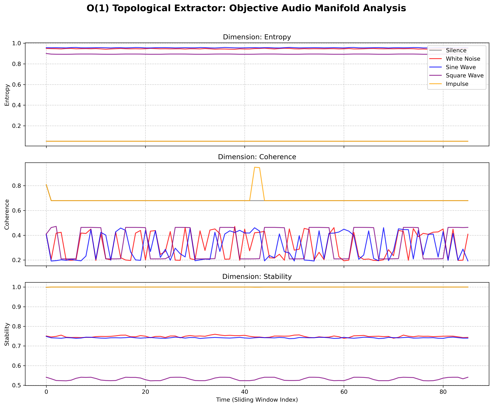

# Structural Manifold Compression

**Experimental tooling for testing whether byte-level structural signatures can support compression-oriented retrieval and bounded reconstruction over large corpora.**

---

## Status
Current status: the repo contains a working benchmark harness and reusable manifold primitives, but the large-corpus scientific claim is still unvalidated.

### Established
- Structural manifold encoding, indexing, and verification primitives exist in the codebase.
- The repo now includes a leakage-aware corpus benchmark pipeline with frozen questions, neutral `paper_###` ids, stripped frontmatter, bounded reconstruction, and a shuffled-manifold control.
- The new demo path is runnable end to end and covered by unit and smoke tests.

### Historical / prior reported
- The benchmark snapshot later in this README summarizes prior results on earlier datasets.
- Those numbers are useful background, but they do not establish the 200-paper corpus-compression claim.

### Not yet established
- 200-paper arXiv compression ratio
- 200-paper retrieval retention
- 200-paper QA retention relative to baseline RAG
- Any claim that this system replaces transformer context handling in general

---

## 1. The Core Problem: $O(N^2)$ Context Collapse
Modern Large Language Models (LLMs) process text by shredding words into isolated optical integers (tokens) and attempting to mathematically reconstruct their relationships across a massive, two-dimensional attention matrix.

Because this matrix scales quadratically—$O(N^2)$—transformers suffer from catastrophic context collapse. As the prompt grows:
1. **Compute Explodes**: VRAM requirements scale exponentially, pricing out local hardware.
2. **Attention Dilutes**: The model "forgets" instructions in the middle of the prompt (The Needle in the Haystack problem).
3. **Reasoning Fails**: The LLM cannot maintain a coherent, continuous state of architectural alignment across a massive codebase.

## 2. Working Hypothesis: The Tripartite Architecture
Structural Manifold Compression is the project hypothesis under test. The current implementation processes raw byte topology through three main components:

1. **The C++ Structural Engine (The Brainstem)**: A sub-millisecond physics engine (`sep_quantum.so`) that slides across byte arrays, translating them into dense `9-byte` structural motifs (Coherence, Entropy, Stability, Hazard) rather than semantic text.
2. **The Valkey Working Memory (The Hippocampus)**: An $O(1)$ vector associative memory that spatially maps these geometric motifs. In design terms, retrieval is a fixed-time native graph traversal rather than a context-window expansion step.
3. **The Mamba SSM / Transformer (The Cortex)**: An algorithmic Heuristic Fallback layer. It only activates when the bare-metal C++ Engine detects an unfamiliar topological sequence (a "Structural Tension Spike").

## 3. Prior Reported Results
The repository also contains earlier internal benchmark results from narrower settings. Treat these as prior reported measurements, not as proof of the new corpus-compression claim:

- **60% vs 20% RAG Precision**: The $O(1)$ spatial Grid Cell router achieves **0.60** precision retrieval on raw code structures, compared to the industry-standard `all-MiniLM-L6-v2` semantic embedding which collapses at **0.20** precision.
- **0.006s FEP Learning**: Utilizing Thermodynamic Simulated Annealing, the Dual-Stream model assimilates a massive contextual contradiction (The Free Energy Principle spike) into long-term Mamba memory in just **0.0063 seconds**.
- **Low-overhead manifold traversal**: Prior internal measurements suggest large working-memory traversal can be substantially cheaper than dense full-context transformer scans for the tested settings.

---

## 4. Corpus Demo
The repo now includes a locked-evaluation corpus demo for testing **LLM-usable compression**:

```text
200 Research Papers
      ↓
Question Freeze (`data/questions.json`)
      ↓
Structural Manifold Compression
      ↓
Manifold Index (`manifold/`)
      ↓
Question
      ↓
Manifold Retrieval
      ↓
Reconstructed Context (max 2000 tokens)
      ↓
LLM / extractive answer
```

Current checkpoint: the benchmark scaffold is implemented and tested, but the 200-paper arXiv run has not yet been completed. Until that run exists, there are no serious compression-retention claims to make from this demo.

### Protocol guarantees
- Questions are frozen before `manifold/` is generated.
- Papers are re-labeled as neutral `paper_###` ids during corpus build.
- Compression strips frontmatter before indexing to avoid title/DOI leakage.
- The LLM never sees the full corpus, only bounded reconstructed chunks.
- A shuffled-manifold control run is written to `results/manifold_results_shuffled.json`.

### What this section currently means
- It proves the benchmark machinery exists.
- It does not yet prove that structural manifolds preserve QA utility at arXiv scale.

### Run the full demo
```bash
python run_full_demo.py
```

For a local smoke test without downloading arXiv papers:
```bash
python run_full_demo.py \
  --input-dir /path/to/local/txt_corpus \
  --qa-backend extractive \
  --embedding-model hash
```

### Outputs
```text
demo/
   build_corpus.py
   generate_manifold.py
   run_baseline_rag.py
   run_manifold_system.py
   evaluate.py

data/
   corpus/
   corpus_manifest.json
   corpus_full.txt
   questions.json

manifold/
   manifold.json
   manifold_index.bin

results/
   compression_metrics.json
   baseline_rag_results.json
   manifold_results.json
   manifold_results_shuffled.json
   qa_results.json
   graphs/
```

---

## Quick Start (The Pair Programmer Daemon)
Experience the structural sidecar locally on any Linux machine. 

Launch the Tripartite loop with just three commands:

1. **Initialize the Spatial Memory (Terminal 1)**
   ```bash
   valkey-server
   ```
3. **Index Your Codebase (Terminal 2)**
   *The Pair Programmer requires a fresh spatial layout of your specific repository to prevent stale codebook mapping.*
   ```bash
   cd structural-manifold-compression
   source .venv/bin/activate
   python scripts/rag/bulk_valkey_ingest.py ./
   ```
4. **Launch the Autonomous Watcher (Terminal 2)**
   ```bash
   python scripts/rag/pair_programmer_agent.py
   ```
5. **Open the 3-Body Telemetry UI (Terminal 3)**
   ```bash
   source .venv/bin/activate
   python app.py
   ```
   *Navigate to `http://localhost:7860` in your browser.*

Try it: Open any `.py` file in the `structural-manifold-compression` repository. Write a function that geometrically contradicts the established coding patterns and save the file. The `pair_programmer_agent.py` daemon will intercept the live save, process the code through the C++ engine without tokenizing it, and flag a massive **Architectural Alignment / Structural Tension** spike in real-time.

### The "Aha Moment" (Real-time $O(1)$ Spike Detection)
Watch the state manifold immediately jump to the "Heuristic Fallback" vertex when chaotic syntax disrupts the structural continuity:


---

## Technical Appendix & Reproducibility

### The Benchmark Snapshot (Full Run @ RTX 3080 Ti)
These are prior dataset results, not the new corpus demo:

| Dataset | Docs | Byte × | Token × | Token Acc. | Char Acc. | Verif. Precision | Verif. FPR |
|---------|-----:|-------:|--------:|-----------:|----------:|-----------------:|-----------:|
| Fox EN  | 112 | 42.03 | 85.48 | 95.35 % | 95.62 % | 91.21 % | 0.087 % |
| Fox CN  | 100 | 42.01 | 88.08 | 94.94 % | 95.04 % | 97.19 % | 0.029 % |
| OmniDoc | 1 349 | 41.59 | 89.49 | 94.90 % | 94.94 % | 80.85 % | 0.017 % |

### Rebuild the Primary Report
The complete Mathematical Methodology, DeepSeek-OCR comparisons, and limits are documented in the LaTeX manuscript:
```bash
make report   # compiles docs/manifold_vs_optical/report.pdf
```

### Multimodal Geometric Demo (Objective Audio Topology)
This visualization is an exploratory demo of how the engine separates several physical audio signals in its measured feature space. It should be read as a qualitative demonstration, not as proof of a general "language of everything" claim.

Run the visualizer:
```bash
python scripts/experiments/visualize_audio_manifold.py
```
*The script synthesizes the 16-bit `.wav` files and streams them blindly through the C++ byte engine (no audio-encoders). The resulting Matplotlib graph shows how the measured geometry separates the tested physical signals:*



## License & Citation

This project is released under the [MIT License](LICENSE). 

```bibtex
@misc{nagy2025manifold,
  author       = {Alexander Nagy},
  title        = {Structural Manifold Compression: A Text-Only Alternative to Optical Context Encoding},
  year         = {2025},
  howpublished = {\url{https://github.com/SepDynamics/structural-manifold-compression}}
}
```
