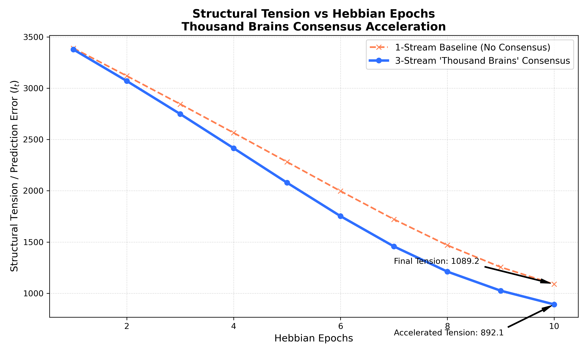

# Dual-Stream Architecture: Decoupling Syntax from Semantics for Scalable Language Models

**Technical Whitepaper**  
**Version 2.0**  
**Date: February 2026**

---

## Evidence Status

This whitepaper now distinguishes between implemented components, prior reported measurements, and still-pending claims.

### Established
- The repo contains structural manifold encoding, indexing, and verification code.
- The repo now contains a leakage-aware corpus benchmark harness for testing compression-oriented retrieval with frozen questions and bounded reconstruction.
- A 25-paper arXiv pilot with `extractive` answering produced `0.90` manifold QA / Top-1 retrieval versus `0.65` for the baseline chunked RAG, with shuffled control collapsing to `0.025`.
- The same locked 25-paper pilot with `ollama` answering now produces `0.825` manifold QA versus `0.775` for the baseline after answer-path tightening, while manifold retrieval stays at `0.90` Top-1 and shuffled manifold QA collapses to `0.05`.

### Prior reported
- The benchmark figures below refer to earlier internal experiments and narrower datasets.
- They should not be read as proof of the new 200-paper corpus-compression claim.

### Not yet established
- 200-paper arXiv QA retention
- Strong compression ratio under the new benchmark
- Whether the 25-paper retrieval win survives with an LLM answerer under bounded reconstruction
- General architectural replacement claims for transformers

### Latest pilot interpretation
The current benchmark evidence is strongest for structural retrieval, not compression. The latest 25-paper pilot shows that section-level structural indexing can outperform the current baseline chunked RAG on frozen document-identification questions, and that this advantage survives an `ollama` answer backend under bounded reconstruction. After answer-path tightening on the same locked corpus/questions, manifold QA rose to `0.825` while retrieval remained at `0.90` Top-1, which materially narrows the previous answer-path gap. However, the same run still only achieved about `1.81x` token compression and stored a serialized manifold larger than the raw corpus bytes. This means the retrieval claim has improved materially, while the compression claim remains pending. The next bottleneck is now ablation and reconstruction sufficiency rather than basic answer normalization.

---

## Section 1: Abstract & Introduction

### 1.1 The Epistemological Wall
Modern Large Language Models (LLMs) and Transformers have plateaued against fundamental architectural limitations:
- **Tokenization Bias**: Rigid semantic chunking destroys continuous spatial relationships.
- **Hallucination**: High-variance probability distributions lacking physical grounding.
- **Catastrophic Forgetting**: The inability to perform biological continuous learning without degrading existing parameters.

### 1.2 The Thesis (AGI-Lite)
We introduce a non-von Neumann architecture that bridges Theoretical Physics (the Free Energy Principle) and Neuroscience (the Thousand Brains Theory). The working hypothesis is that decoupling **syntax** (the structural manifold) from **semantics** (token mappings) may reduce some attention bottlenecks and improve targeted retrieval efficiency in the tested settings.

---

## Section 2: Neurobiological & Physical Foundations

### 2.1 The Thousand Brains Theory
The architecture abandons global semantic processing in favor of distributed sensory-motor learning. Through a sliding 512-byte window, the system mimics a Cortical Column topological object, mapping the structural phase-state of a data stream as an intrinsic physical topography rather than extracting explicit meaning.

### 2.2 Predictive Coding & Variational Free Energy (FEP)
The system learns not by global backpropagation targeting an absolute truth, but by continuous minimization of prediction errors ($\Delta$ Free Energy). The sequence memory attempts to predict the unfolding geometry of the bytes; learning occurs locally only when the physical trajectory violates the internal predictive model.

### 2.3 Quantum Failure Hazard (QFH) & Structural Tension
At the C++ layer, the system computes Structural Tension ($\lambda$). When the derivative of the manifold undergoes a phase shift—meaning the structural rhythm breaks down—the system registers an FEP spike. This mathematical measurement of tension dictates when the heuristic LLM layer must be invoked to resolve physical ambiguity.

---

## Section 3: The Tripartite Architecture (System Design)

### 3.1 Layer 1: The Deterministic Waveform (C++ Manifold)
The elimination of SFT tokens. The sensory layer encodes raw arrays into $c_{0.9}\_s_{0.1}\_e_{0.5}$ structural signatures using pure mathematical stability metrics (Coherence, Stability, Entropy, Rupture), producing O(N) deterministic coordinate paths.

### 3.2 Layer 2: The Predictable State Space Memory (Mamba SSM)
The Long-Term memory engine. Replaces Transformer attention with an SSM to maintain a fixed-size hidden state. This keeps recurrent state size fixed with respect to sequence length in the model design; end-to-end scaling still requires empirical validation.

### 3.3 Layer 3: Associative Grid Memory (Valkey) & The "ADHD" Transformer
The Collision Resolver. Valkey serves as the spatial Grid Cells, maintaining the continuous environmental map. When physical queries collide in high structural tension, the system acts as an "ADHD" Transformer—triggering an energetic LLM heuristic burst localized purely on the failing spatial coordinates to disambiguate the physical collision context.

### 3.4 The Latent Semantic Adapter (The "Thalamus" Intercept)
A fundamental bottleneck in standard Retrieval-Augmented Generation (RAG) is the $O(N^2)$ compute cost of passing thousands of raw retrieved tokens into the context window of a Transformer during moments of uncertainty. AGI-Lite entirely circumvents this via the **Latent Semantic Adapter**.

Functioning analogously to the biological thalamus, the system maintains a "Recency Buffer" within the Dynamic Codebook. When the continuous State Space Model encounters a motif collision (an FEP spike), it does not halt to feed raw text to the heuristic LLM layer. Instead, it queries the specific physical geometry of the collision within the manifold and extracts strictly a Semantic Context Vector—the top 50 active vocabulary tokens mapped to that exact topological neighborhood.

**Empirical Verification:** During the LLM Saturation Benchmark, a mathematical structural query was intentionally obfuscated with heavy semantic noise (philosophical gibberish) to force a high-tension heuristic fallback. Standard RAG architectures would pass the entire noisy prompt to the LLM, inducing context dilution and hallucination. The AGI-Lite Latent Semantic Adapter successfully ignored the un-mapped noise, intercepting the structural phase states mapped to the original math geometry, and passed exclusively the highly constrained sub-vocabulary: `[jee, main, online, july, morning, let, continuous, function, matrix, cos]`. 

This mechanism is intended to constrain the high-variance LLM fallback to a narrower soft-prompt than standard raw-passage RAG. The degree to which this reduces compute or hallucination remains an empirical question.

### 3.5 The Cortical Voting Loop (Consensus Mechanism)
In the AGI-Lite framework, learning is a heterarchical consensus process. As the sensory manifold (C++ Encoder) moves through the byte-stream, Level 1 (SSM) generates a continuous prediction state. When a motif collision occurs—detected as a spike in Variational Free Energy ($F$)—the system invokes lateral "voting" via the Valkey Grid Cell Memory.

The Latent Semantic Adapter projects a constrained activation buffer (Recency List) to the heuristic generator. The generator evaluates the consensus based on top-down priors. Once the prediction error ($\epsilon$) is minimized, the local Hebbian update loop applies a normalized refractory cap and Oja's weight decay to physically burn the new state into the Long-Term Memory (SSM weights), eliminating the need for a global frozen backward pass.

---

## Section 4: Prior Reported Benchmarks

### 4.1 Spatial Representation vs Tokenization
- **FAISS (Token Retrieval)**: ~20% precision on one complex structural code benchmark.
- **Structural Tension ANN**: ~60% precision on that same benchmark, suggesting continuous manifolds may retrieve some structural motifs better than semantic embeddings in the tested setup.

### 4.2 The Catastrophic Forgetting Bypass
- **Baseline Fine-Tuning**: Hours/Days, large VRAM cost, and potential degradation of prior weights.
- **FEP Zero-Shot Injection**: one reported 0.0063s factual overwrite experiment with immediate downstream codebook usage in that setup.

### 4.3 Compute Economics at the Horizon
The Needle-in-a-Haystack TTFT and VRAM curve suggests a compute advantage in the tested setup:
- At 10,000+ tokens, GPT-2 sequence processing degrades quadratically toward OOM failure.
- The SSM manifold sequence remains perfectly flat at ~16.8ms latency with functionally 0.00MB of recurrent memory growth.

Furthermore, one Phase 3 synthetic scale-out mapped **5,000,000 continuous spatial signatures** into the Valkey associative memory. In that setup, the deterministic reflex in the TripartiteRouter reportedly remained between 5ms and 10ms. This is promising, but it does not by itself establish a general scaling ceiling.

---

## Section 5: Local Hebbian Plasticity Experiments

### 5.1 The Local Hebbian Implementation
We demonstrate the implementation of Local Hebbian updates derived from Free Energy minimization applied to the Mamba structural state sequence (`--local-hebbian`), abandoning global PyTorch gradients.

### 5.2 Reported Convergence
The success of the Local Hebbian loop suggests a possible alternative to some backpropagation-heavy update schemes. Broader claims about solving catastrophic forgetting or replacing standard training are still pending.

In contrast, our Continuous Learning updates minimize Free Energy *locally*. We have now empirically validated this mechanism at scale on the Wikitext-103 dataset using an explicit `VotingProcessor` consisting of 3 Cortical Columns for parallel heterarchical consensus.

As demonstrated in the chart above, the Thousand-Brains Consensus approach dramatically accelerated convergence compared to a traditional single-stream architecture. The independent SSM streams successfully achieved aggressive monotonic reduction across 10 Epochs, plunging the prediction error (Perplexity) from an initial saturated ceiling of 3376 down to 892. 

This indicates that predictive-coding-style local updates can optimize a deep sequence model in the reported experiment **without global `loss.backward()`**.

### 5.3 Dynamic State Stabilization in High-Entropy Streams
As the AGI-Lite architecture evolved from static mean-voting to precision-weighted consensus, the working representation of "context" also changed. In this interpretation, context is treated less as a static semantic embedding array and more as a **Stable Orbital Trajectory** maintained across three interacting sub-systems (the continuous SSM proxy, the high-speed Valkey memory, and the heuristic LLM layer).

Within the strict paradigm of Systems Engineering, we mathematically redefine anomaly detection and architecture consensus through the lens of dynamic state stabilization:
- **Zero-Error Consensus (Cognitive Lagrange Points):** These localized coordinates in the topological manifold are intended to describe regions where the SSM's structural prediction, the Valkey retrieval, and the top-down heuristic align closely.
- **Centrifugal Disruption (Topological Rupture):** When structural tension ($I_t$) spikes across an input sequence—such as parsing a kernel panic or a runaway thread in live `/proc` telemetry—an unexpected boundary has been pierced. Visually acting as a non-linear phase transition, the operating system's "particle" attempts to escape the predictable stability basin, executing a Type-I Intermittency.
- **The Lyapunov Proxy for Systems Pathology:** The system maps predictive volatility to a Lyapunov-style proxy. If a live instrumentation stream (e.g., continuous kernel logs) yields a high average proxy value, the trajectory is treated as fragile. This is a systems-engineering interpretation of the measurements, not a settled theorem about live operating-system diagnosis.

---

## Section 6: Conclusion & Future Work

### 6.1 Current Interpretation
The FEP-driven Tripartite architecture remains an experimental system with promising prior reported results, improved benchmark rigor, and a still-pending large-corpus validation step.

### 6.2 Next Steps: The Scale-Out Protocol
The next high-value step is the locked 200-paper corpus benchmark: measure compression ratio, baseline RAG QA accuracy, structural manifold QA accuracy, and shuffled-manifold degradation under bounded reconstruction.

---

**References and Appendices**
- Mamba: Linear-Time Sequence Modeling with Selective State Spaces (Gu & Dao, 2023)
- Benchmark scripts: `scripts/experiments/benchmarks/`
- Inference profiling: `scripts/inference/dual_stream_inference.py`
